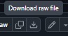

<!-- README.md: 初めて使う人向けに、ローカル起動と音源分離の操作手順をまとめる。 -->

# Music Separater

ブラウザから音声ファイルをアップロードし、ボーカル・伴奏や複数の歌声に分離するアプリケーションです。分離した音声は画面上で試聴し、WAV 形式でダウンロードできます。

## Colab 用ノートブックを GitHub からダウンロードする

Google Colab で使用する場合は、先に GitHub から `music_separater.ipynb` をダウンロードします。

1. [music_separater.ipynb の ページ](https://github.com/sorawww31/musicseparater/blob/master/music_separater.ipynb) を開きます。
2. ファイル一覧の上にある **Download raw file** をクリックします。
    
    
3. [Google Colab](https://colab.research.google.com/) を開き、**ファイル → ノートブックをアップロード**を選択します。
4. ダウンロードした `music_separater.ipynb` を選択して読み込みます。

読み込んだノートブックでは、GPU を選択してから「① 準備する」→「② アプリを開く」の順に実行してください。

## Google Colab で使う

[music_separater.ipynb](music_separater.ipynb) を Colab で開き、GPU を選択して、
「① 準備する」→「② アプリを開く」の順に ▶ を押してください。
ノートブック内に日本語の操作画面が表示され、アップロード・分離・試聴・WAV 保存ができます。
手元のパソコンに Docker や Python をインストールする必要はありません。

共有者は、**今回の変更を含むコードを取得可能な公開 GitHub リポジトリに置き**、
①の `repository_url` に HTTPS URL を設定してノートブックを共有してください。
`revision` にコミット ID を指定すれば配布バージョンを固定できます。空欄では既定ブランチを取得します。
再実行では取得済みコードを利用します。URL・revision の変更や最新版の再取得は、
ランタイムを削除してから①を実行してください。非公開リポジトリの認証はこの手順の対象外です。

### Colab の実行条件と実装

- GPU ランタイムを使用します。Colab の Python は 3.13 のままで利用でき、変更不要です。
- uv が Python 3.12 を選択・必要に応じて取得し、`.colab/venv312` に独立環境を作ります。
  Colab の Python / PyTorch は引き継ぎません。uv がない場合は `.colab/tools` に導入します。
- `uv sync --python 3.12 --locked --no-install-project --inexact` で既存の
  `backend/pyproject.toml` と `backend/uv.lock` の依存を同期します。
  対象環境は `UV_PROJECT_ENVIRONMENT` で `.colab/venv312` に固定します。
- CUDA 12.6 対応 PyTorch を公式 wheel 配布元から同じ環境へ追加します。
  バージョンと配布元は `colab_runtime/config.py` に定義し、lock から出力した制約で
  共通依存の変更を防ぎます。`--inexact` により再実行時も追加した PyTorch を保持します。
  GPU 検証・サーバー起動・モデルの子プロセスは、この環境の Python を使用します。
- Colab の npm / Node.js を優先し、Node.js が Vite の対応版より古い場合だけ `.colab` に補います。
  `npm ci` で既存 UI をビルドします。モデル用コードと重みは
  `backend/Dockerfile` と同じ固定 commit / SHA-256 で取得します。
- GPU は PyTorch と ONNX Runtime の小さな演算で確認します。SepACap は BF16 対応 GPU が必要です。
- `colab_runtime` が既存 API と UI を同一ポートで配信し、Colab の iframe 内に表示します。
  調整値は `colab_runtime/config.py`、起動ログは `.colab/server.log` にあります。
- ローカル検証では Colab のブラウザ・GPU 割り当てを再現できません。実際の Colab での初回分離は別途確認が必要です。

開発時の Colab 補助コードの検証: `python -m unittest discover -s tests -v`。
既存 API と UI のテストは各 README の手順を使用してください。

①の準備ログとエラーは、そのセル内に順次表示されます。失敗した場合は、
「準備に失敗しました」の直前のログを確認してください。
古いコピーで `CalledProcessError` だけが表示される場合は、更新したノートブックを開いてください。
「困ったとき：ログを表示する」はアプリ起動後のログ用です。

旧版から更新する場合は、変更したコードを GitHub に反映してから、更新したノートブックを
Colab で開き、ランタイムを削除して①から実行してください。セルだけの差し替えでは
取得済みの `colab_runtime` は更新されません。終了前に必要な WAV を保存してください。

参照: [Colab 公式表示 API](https://github.com/googlecolab/colabtools/blob/main/google/colab/output/_util.py)、
[ONNX Runtime CUDA](https://onnxruntime.ai/docs/execution-providers/CUDA-ExecutionProvider.html)、
[Vite の相対ベース URL](https://vite.dev/guide/build.html#relative-base)。
環境構築: [uv の Python 管理](https://docs.astral.sh/uv/concepts/python-versions/)、
[PyTorch 公式 CUDA wheel](https://pytorch.org/get-started/previous-versions/)。

## ローカルで使う場合に必要な環境

- Docker と Docker Compose
- NVIDIA GPU とドライバー、および Docker から GPU を利用できる環境（NVIDIA Container Toolkit など）
- 初回ビルド・モデル取得用のインターネット接続

現在の Docker Compose 構成は NVIDIA GPU を 1 台使用します。SepACap には BF16 対応 GPU が必要です。既存のバックエンド検証環境は RTX 4070 Ti（VRAM 12 GB）です。詳細は [バックエンド README](backend/README.md) を参照してください。

## リポジトリを取得する

Git がインストールされた環境で、次のコマンドを実行します。`<リポジトリURL>` はこのリポジトリの Git URL に置き換えてください。

```bash
git clone <リポジトリURL> musicseparater
cd musicseparater
```

以降のコマンドは、`compose.yaml` があるリポジトリのルート（`musicseparater` ディレクトリ）で実行します。

## 初回セットアップと起動

以下のコマンドは、リポジトリのルート（`compose.yaml` があるディレクトリ）で実行します。

### 1. 環境設定ファイルを用意する

```bash
touch backend/.env
```

`backend/.env` は Docker Compose が読み込むため、トークンを使わない場合も空ファイルとして用意してください。既存のファイルの内容は上記コマンドで変更されません。

Hugging Face のトークンを利用する場合は、`backend/.env` に以下を設定します。

```dotenv
HF_TOKEN=自分のHugging_Faceトークン
```

フロントエンドの API 接続先は、既定で `http://localhost:8000` です。変更が必要な場合は [設定例](frontend/.env.example) を参考に `frontend/.env.local` に `VITE_API_URL` を設定してください。既存の `frontend/.env` に設定がある場合も確認してください。

### 2. ビルドして依存パッケージを導入する

```bash
docker compose build
docker compose run --rm frontend npm install
```

初回ビルドではモデルのソースや一部の重みも取得するため、時間がかかります。フロントエンドの依存パッケージは上記の `npm install` で導入します。

### 3. 起動する

```bash
docker compose up -d
```

- アプリ画面: <http://localhost:5173>
- バックエンド API ドキュメント: <http://localhost:8000/docs>

起動状況や処理ログは次のコマンドで確認できます。

```bash
docker compose ps
docker compose logs -f backend frontend
```

ログ表示は `Ctrl+C` で終了できます。アプリを停止する場合は次を実行してください。

```bash
docker compose down
```

次回からは `docker compose up -d` で起動できます。Dockerfile やバックエンドの依存関係を変更した場合は、再ビルドしてください。

## 基本的な使い方

1. <http://localhost:5173> を開きます。
2. 「対象楽曲」に音声ファイルをドラッグ＆ドロップするか、クリックして選択します。選択できる形式は **MP3 / WAV / FLAC** です。
3. 「分離設定」で分離タイプとモデルを選びます。ボーカルと伴奏に分ける場合は、初期設定の「2ステム」→「BS PolarFormer」を使います。
4. 「分離を開始」をクリックします。音声のアップロード後、処理の段階と進捗が表示されます。
5. 「完了」になったら各音声を再生し、必要なものを「WAVをダウンロード」から保存します。

ステムとは、分離後のボーカルや伴奏などの個別の音声です。初回実行時は追加のモデル取得が発生することがあります。ジョブは 1 件ずつ処理されるため、別のジョブの実行中は「処理待ち」になります。

## 目的別のモデル選択

| 目的 | 分離タイプ / 方式 | モデル | 分離結果 |
| --- | --- | --- | --- |
| ボーカルと伴奏に分ける | 2ステム | BS PolarFormer | Vocals、Instrumental |
| 2 人の歌声を分ける | 複数歌声 / Blind separation | UNMIXX | Singer 1、Singer 2、Instrumental |
| アカペラを声部ごとに分ける | 複数歌声 / Blind separation | SepACap | alto、bass、finger snap、lead vocal、soprano、tenor、vocal percussion、Instrumental |
| 声域（女声 / 男声）で分ける | 複数歌声 / Blind separation | jaCappella DPTNet | vocal percussion、bass、alto、tenor、soprano、lead vocal、Instrumental |
| 指定した歌手の声を取り出す | 複数歌声 / Target singer extraction | Singer-Informed (Concat λ=0.1) | Target Vocal、Other Singer + Instrumental |

「4ステム」「6ステム」と、モデル一覧で「未実装」と表示されるモデルは現在利用できません。

### 2 人の歌声を分ける

「複数歌声」→「Blind separation」→「UNMIXX」または「MedleyVox / iSRNet」を選択します。参照音声は不要です。出力は匿名の `Singer 1` / `Singer 2` で、歌手名を識別する機能ではありません。どちらも 2 出力固定なので、3 人以上の歌声は分けられません。

SepACap は歌手の人数を指定して分けるモデルではなく、7 つの固定声部に分けるモデルです。

### 男声 2 人 + 女声 1 人から女声だけを取り出す

「複数歌声」→「Blind separation」→「jaCappella DPTNet」を選択します。歌手ごとではなく声域ごとに分かれるモデルなので、女声は `soprano` / `alto`、男声は `tenor` / `bass` 側へ出ます。歌手を名指しで選ぶ機能ではないため、同じ声域に 2 人いる場合はその 2 人が同じステムへ混ざります。

このモデルの重みは研究用途（cc-by-nc-4.0）で、商用利用はできません。

### 特定の歌手の声を取り出す

1. 「対象楽曲」に分離したい曲を選択します。
2. 「複数歌声」→「Target singer extraction」を選択します。
3. 「Singer-Informed (Concat λ=0.1)」を選択します。
4. 表示された「対象歌手の参照音声」に、**その歌手だけが歌う 3 秒以上の音声**を選択します。対象楽曲とは別の曲でも構いません。
5. 「分離を開始」をクリックします。

`Target Vocal` が対象歌手の声、`Other Singer + Instrumental` が残りの歌声と伴奏です。3 人以上が混ざった曲での品質は未検証です。

## ファイルの保存先

Docker Compose のボリューム設定により、音声とキャッシュはホスト側の次の場所に保存されます。

| 保存内容 | パス |
| --- | --- |
| アップロードした楽曲・参照音声とメタデータ | `backend/audio/sources/<audio_id>/` |
| ジョブのメタデータ | `backend/audio/separations/<job_id>/metadata.json` |
| 完成した WAV ファイル | `backend/audio/separations/<job_id>/stems/` |
| Hugging Face から取得するモデルのキャッシュ | `backend/.model-cache/` |

`docker compose down` で停止しても、これらのファイルは残ります。バックエンドを再起動すると、前回の処理待ち・実行中ジョブは失敗扱いになります。途中からの再開はできないため、画面から分離をやり直してください。

## 困ったとき

| 症状 | 確認すること |
| --- | --- |
| `backend/.env` がないと言われる | ルートで `touch backend/.env` を実行します。 |
| フロントエンドで `vite: not found` が出る | `docker compose run --rm frontend npm install` を実行してから起動し直します。 |
| アップロードや API 接続に失敗する | バックエンドの起動と `VITE_API_URL` を確認します。既定の CORS 設定で許可される画面の URL は `http://localhost:5173` です。 |
| GPU 関連のエラーで起動・分離に失敗する | Docker から NVIDIA GPU を利用できるか確認します。SepACap では BF16 対応も必要です。 |
| 分離が失敗する | 画面のエラーと `docker compose logs --tail=100 backend` を確認します。 |
| 「分離を開始」を押せない | 対象楽曲と実装済みモデルを選択します。Target singer extraction では参照音声も必要です。 |

API の利用例やモデルの詳細は [バックエンド README](backend/README.md)、画面側の設定・検証方法は [フロントエンド README](frontend/README.md) を参照してください。
